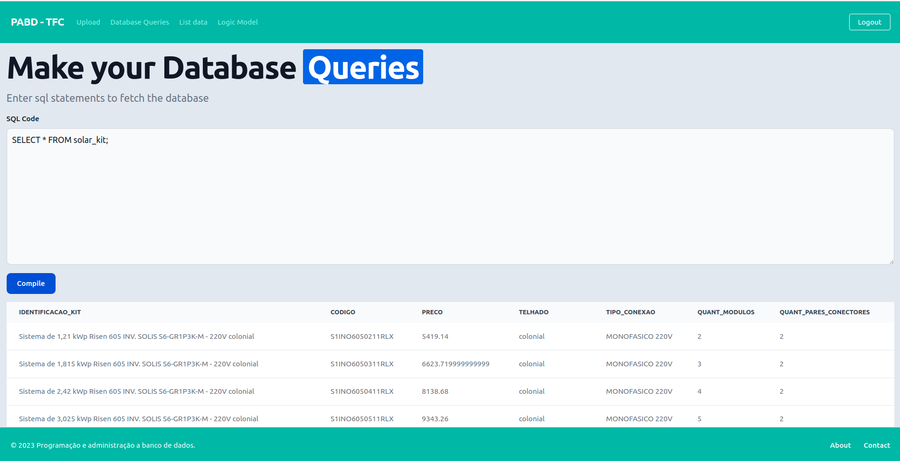

# IFRN - Programação e administração a banco de dados

Este repositório contém o código de uma atividade de importação de dados com Django. O objetivo do trabalho foi criar uma simples aplicação em que possamos trabalhar com importação de dados, vindo de uma planilha (Excel/CSV). Abaixo segue o modelo lógico e o layout de uma das telas da aplicação.

## Layout



## Logic Model


## Features

- Custom SQL queries
- Pagination system

## Techs

- Django
- Pandas
- TailwindCSS

## Others Packages

- flake8
- black

## Installation

Create virtual environment

```bash
virtualenv venv
```

Active virtual environment

```bash
source venv/bin/activate
```

Install dependencies

```bash
pip install -r requirements.txt
```

Run the application

```bash
python manage.py runserver 8000
```

Access http://localhost:8000
